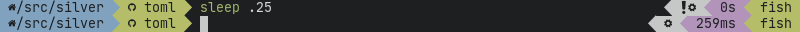

# silver

[](https://gitter.im/reujab-silver/community?utm_source=badge&utm_medium=badge&utm_campaign=pr-badge&utm_content=badge)

[](https://repology.org/project/silver/versions)

A cross-shell customizable powerline-like prompt heavily inspired by [Agnoster](https://github.com/agnoster/agnoster-zsh-theme). The faster rust port of [bronze](https://github.com/reujab/bronze).<br/>


## How does it work?

Unlike most shell prompts, silver is not written in shell script, but entirely in Rust.

When `silver init` is run, it outputs shell code that sets your left prompt to run `silver lprompt` and right prompt to `silver rprompt`, which output the actual prompt.

## Getting started

Since silver is not written in shell script, it should theoretically be compatible with any shell, but the supported shells are Powershell, Bash, Zsh, fish, Ion and Elvish.

### Icons

To be able to use the custom icons (which are enabled by default), you must patch your font or install a pre-patched font from [Nerd Fonts](https://github.com/ryanoasis/nerd-fonts).

### Installation

#### From source

- install and setup [Rust](https://www.rust-lang.org/)
- run `cargo install --git https://github.com/reujab/silver`

#### From pre-compiled binary

- download a binary on the [releases page](https://github.com/reujab/silver/releases)
- add binary to `PATH` environment variable

#### macOS prerequisite

On macOS, you will have to do a bit more:

- install [Homebrew](https://brew.sh/)
- run `brew install coreutils`
- run `brew install openssl`
- add `alias date="gdate"` to your shell config

### Configuration

Now that you have silver installed, you need to create `silver.toml` and put it in the following path: 
- **Linux:** `~/.config/silver/silver.toml` or `$XDG_CONFIG_HOME/silver/silver.toml`
- **macOS:** `~/Library/Preferences/rs.silver/silver.toml`

To have your prompt look like the screenshot at the top of the readme, configure `silver.toml` with:

```toml
[[left]]
name = "dir"
color.background = "blue"
color.foreground = "black"

[[left]]
name = "git"
color.background = "green"
color.foreground = "black"

[[right]]
name = "status"
color.background = "white"
color.foreground = "black"

[[right]]
name = "cmdtime"
color.background = "magenta"
color.foreground = "black"

[[right]]
name = "shell"
color.background = "green"
color.foreground = "black"
```

Now that silver is configured, you need to evaluate its bootstrap code.

#### Bash

`~/.bashrc`:

```sh
source <(silver init)
```

#### Ion

`~/.config/ion/initrc`:

```sh
eval $(silver init)
```

#### Powershell

```ps1
Invoke-Expression -Command $(silver init | Out-String)
```

#### Zsh

See [zsh plugin](https://github.com/silver-prompt/zsh#installation)

#### Fish

See [fish plugin](https://github.com/silver-prompt/fish#installation)

#### Elvish

See [elvish plugin](https://github.com/silver-prompt/elvish#installation)

## Documentation

Documentation is available on [the wiki](https://github.com/reujab/silver/wiki).

## Project structure

- [`src/`](src)
  - [`modules/`](src/modules)
    - [`cmdtime.rs`](src/modules/cmdtime.rs)
      - source code for the [`cmdtime`](https://github.com/reujab/silver/wiki/Command-Time) module
    - [`dir.rs`](src/modules/dir.rs)
      - source code for the [`dir`](https://github.com/reujab/silver/wiki/Directory) module
    - [`env.rs`](src/modules/env.rs)
      - source code for the [`env`](https://github.com/reujab/silver/wiki/Environment-Variable) module
    - [`git.rs`](src/modules/git.rs)
      - source code for the [`git`](https://github.com/reujab/silver/wiki/Git) module
    - [`mod.rs`](src/modules/mod.rs)
      - handles modules
    - [`os.rs`](src/modules/os.rs)
      - source code for the [`os`](https://github.com/reujab/silver/wiki/OS) module
    - [`status.rs`](src/modules/status.rs)
      - source code for the [`status`](https://github.com/reujab/silver/wiki/Status) module
    - [`time.rs`](src/modules/time.rs)
      - source code for the [`time`](https://github.com/reujab/silver/wiki/Time) module
    - [`user.rs`](src/modules/user.rs)
      - source code for the [`user`](https://github.com/reujab/silver/wiki/User) module
    - [`virtualenv.rs`](src/modules/virtualenv.rs)
      - source code for the [`virtualenv`](https://github.com/reujab/silver/wiki/virtualenv) module
  - [`cli.rs`](src/cli.rs)
    - parses command line arguments
  - [`config.rs`](src/config.rs)
    - parses TOML
  - [`icons.rs`](src/icons.rs)
    - processes icons, separators, and Unicode
  - [`init.bash`](src/init.bash)
    - bootstrap code for Bash
  - [`init.ion`](src/init.ion)
    - bootstrap code for Ion
  - [`init.ps1`](src/init.ps1)
    - bootstrap code for Powershell
  - [`main.rs`](src/main.rs)
    - does all the magic
  - [`print.rs`](src/print.rs)
    - prints prompt segments
  - [`sh.rs`](src/sh.rs)
    - shell-specific code
